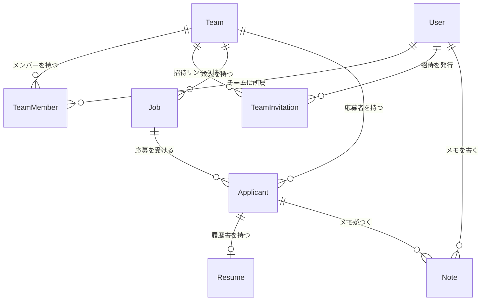
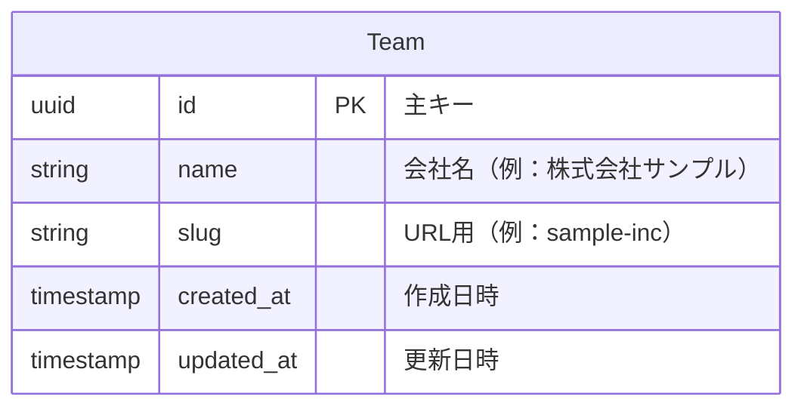
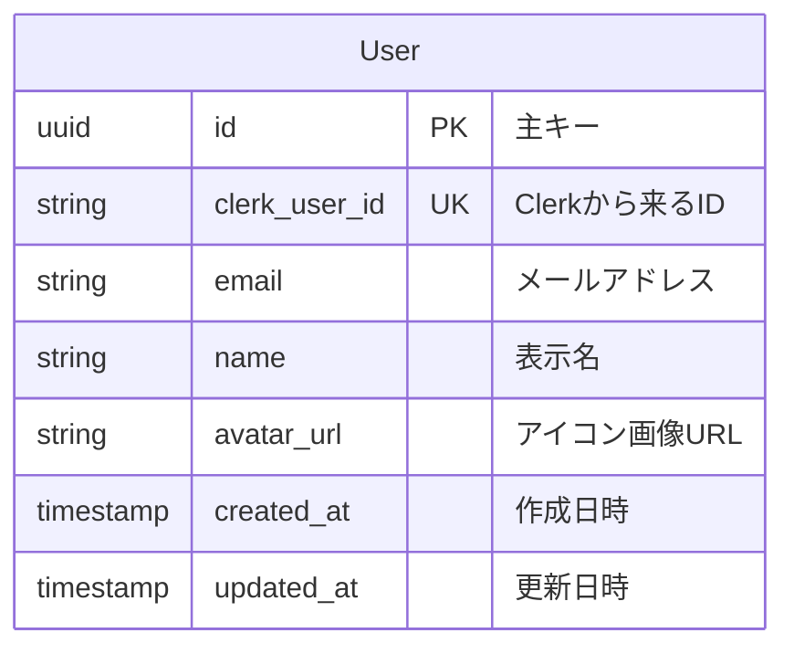
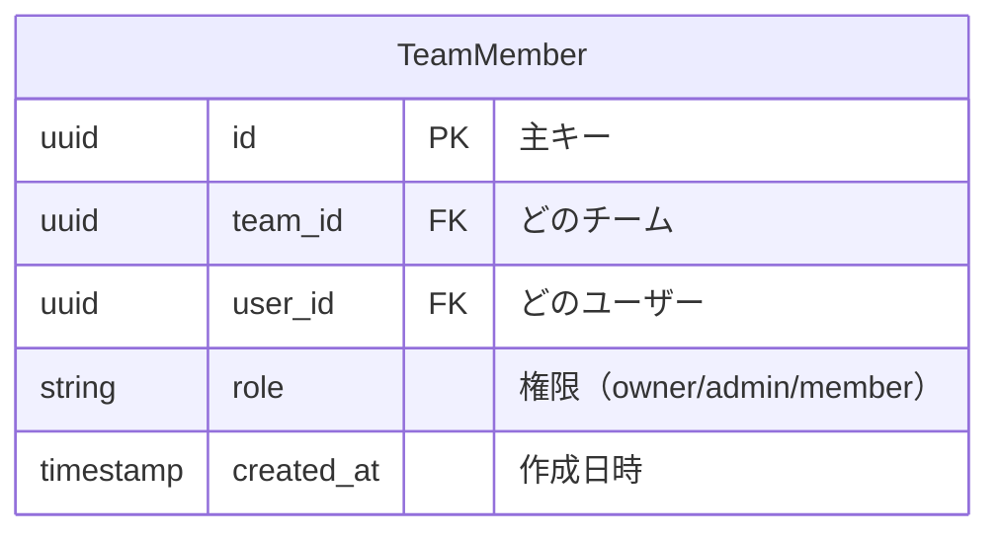
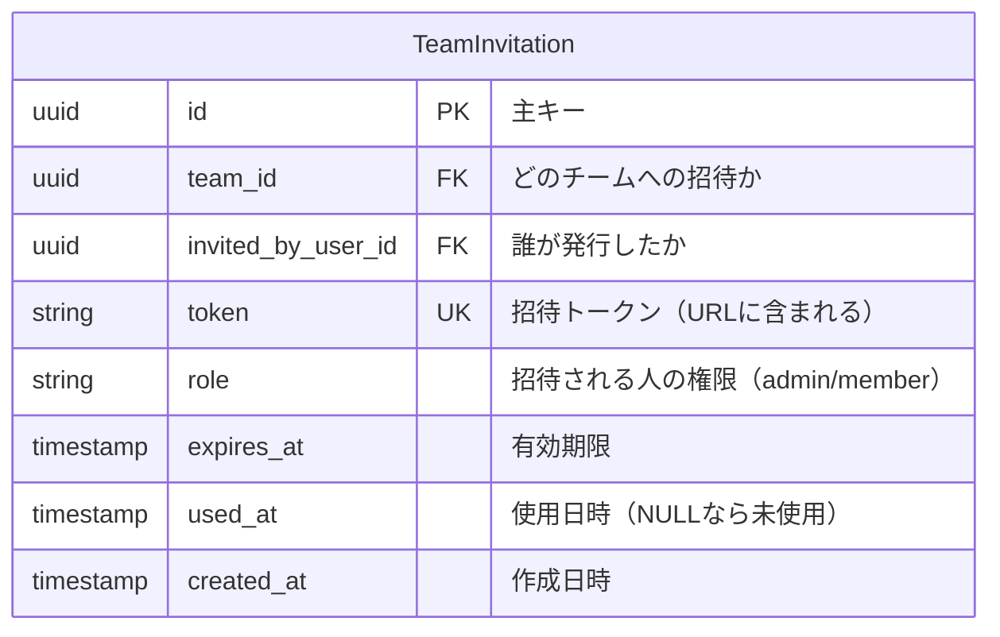
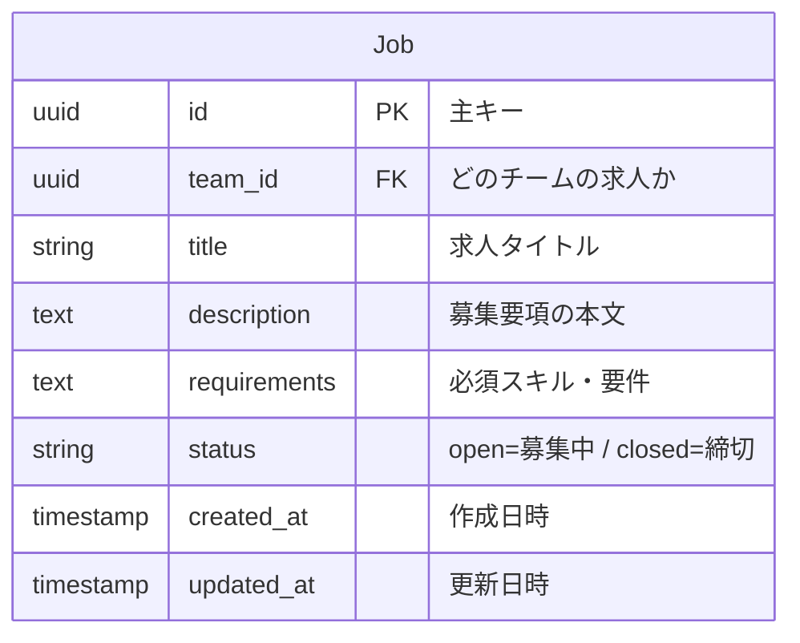
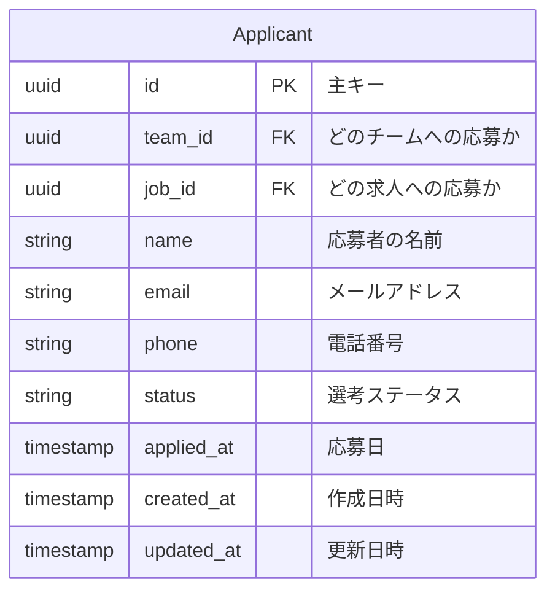
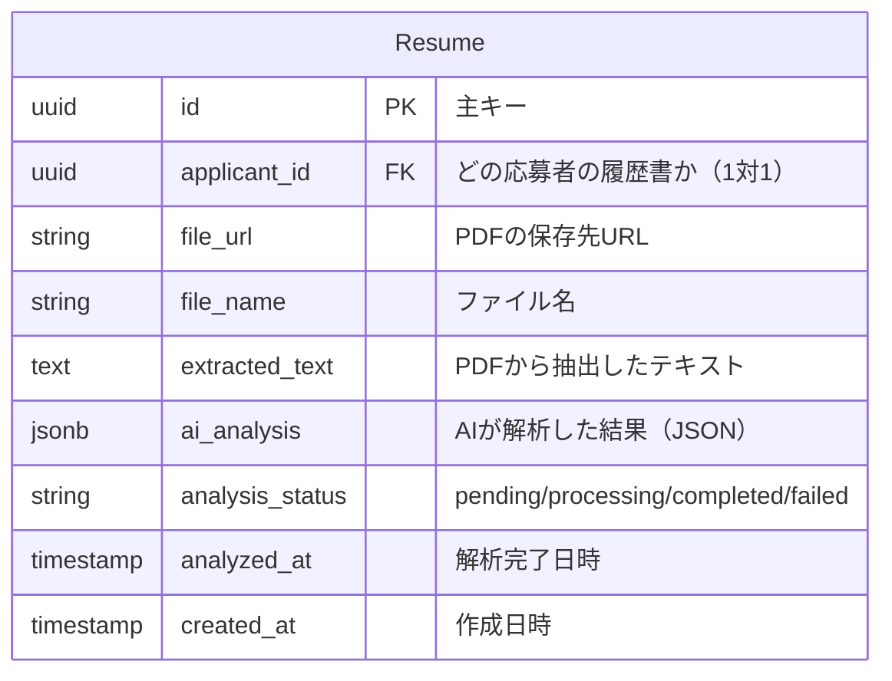
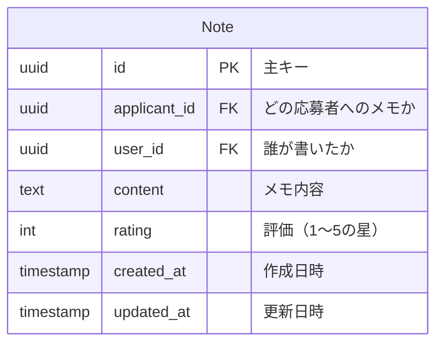
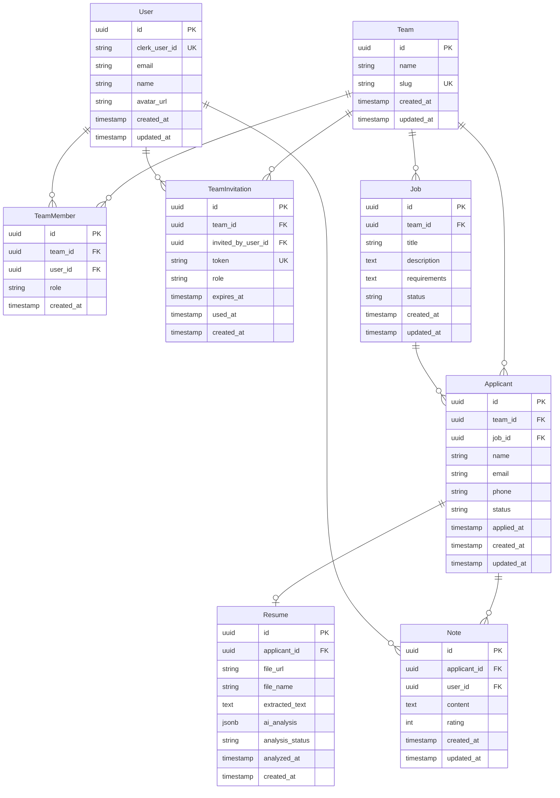

# ER図

## 全体像



## テーブル詳細

### Team（チーム = 会社）



**役割**: 会社単位でデータを分離するためのテーブル（マルチテナント）

**slugとは？**

URLで使う人間が読める識別子。

```
会社名: 株式会社リクルート
slug: recruit

→ URL: https://resumatch.com/recruit/jobs
                              ~~~~~~
                              ここがslug
```

UUIDだと `/a1b2c3d4-xxxx/jobs` みたいになって見づらいので、人間が読めるslugを使う。

---

### User（ユーザー = ログインする人）



**役割**: ログインユーザーの情報を保存

**Clerkとの関係**:

```
[Clerk（認証サービス）]
    ↓ ログイン成功時にuser_idが来る
[User テーブル]
    clerk_user_id = "user_abc123"  ← これで紐付け
```

---

### TeamMember（誰がどのチームに所属してるか）



**役割**: UserとTeamの多対多を解決する中間テーブル

```
例：田中さんが2つの会社に所属

┌───────────────────────────────────────────────────┐
│ TeamMember                                        │
├───────────────────────────────────────────────────┤
│ team_id=リクルート  user_id=田中  role=owner      │
│ team_id=サンプル社  user_id=田中  role=member     │
└───────────────────────────────────────────────────┘
```

---

### TeamInvitation（招待リンク）



**役割**: チームへの招待リンクを管理

**招待フロー**:

```
1. チームオーナーが招待リンクを発行
   → TeamInvitation レコード作成（token生成）

2. 招待リンクをメール等で共有
   → https://resumatch.com/invite/abc123xyz
                                  ~~~~~~~~~
                                  これがtoken

3. 招待された人がリンクをクリック
   → サインアップ or ログイン

4. 認証後、自動的にチームに参加
   → TeamMember レコード作成
   → TeamInvitation.used_at を更新
```

**tokenの仕様**:
- ランダムな文字列（例: nanoid で生成）
- 推測されにくい長さ（21文字以上推奨）
- 1回使用したら無効化（used_at に日時が入る）

**有効期限**:
- デフォルト7日間
- 期限切れの招待リンクは使用不可

---

### Job（求人 = 募集中のポジション）



**役割**: 募集ポジションを管理

```
例：リクルートの求人一覧

┌────────────────────────────────────────────────────────┐
│ Job                                                    │
├────────────────────────────────────────────────────────┤
│ team_id=リクルート  title=バックエンドエンジニア  status=open   │
│ team_id=リクルート  title=フロントエンドエンジニア status=open  │
│ team_id=リクルート  title=デザイナー           status=closed   │
└────────────────────────────────────────────────────────┘
```

---

### Applicant（応募者 = 候補者）



**選考ステータスの流れ**:

```
screening → first_interview → second_interview → offer
(書類選考)    (1次面接)         (2次面接)          (内定)
                                    ↓
                                rejected（不採用）
```

**なぜ team_id を持つか？**

`job_id` から `Job.team_id` を辿れば分かるが、検索効率のために冗長に持たせている。
応募者一覧をチームで絞り込む際、JOINなしで済む。

---

### Resume（履歴書 = PDFとAI解析結果）



**処理の流れ**:

```
1. PDFアップロード → file_url に保存
2. テキスト抽出   → extracted_text に保存
3. AI解析実行    → analysis_status = "processing"
4. 解析完了      → ai_analysis にJSON保存、status = "completed"
```

**ai_analysis の構造**:

```json
{
  "summary": "Java 5年、PM経験2年。金融系システム開発が得意。",
  "skills": ["Java", "Spring Boot", "AWS", "PostgreSQL"],
  "experience": [
    {
      "company": "株式会社〇〇",
      "position": "バックエンドエンジニア",
      "period": "2019年4月〜2024年3月",
      "description": "銀行向け基幹システムの開発..."
    }
  ],
  "education": [
    {
      "school": "〇〇大学",
      "degree": "工学部 情報工学科",
      "period": "2015年4月〜2019年3月"
    }
  ],
  "certifications": ["AWS SAA", "応用情報技術者"]
}
```

---

### Note（メモ = 面接後のフィードバック）



**役割**: 面接官が候補者にコメント・評価を残す

```
例：

┌─────────────────────────────────────────────────────────┐
│ 応募者: 山田太郎                                         │
├─────────────────────────────────────────────────────────┤
│ [田中] ★★★★☆ 技術力は高い。コミュ力も問題なし。         │
│ [佐藤] ★★★☆☆ 経験は十分だが給与希望が高め。            │
└─────────────────────────────────────────────────────────┘
```

---

## 完全版ER図


